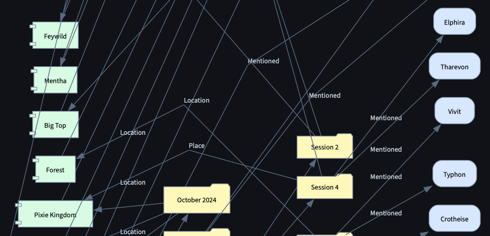

##  Change log
The changelog has been moved to the bottom of CHANGELOG.md
Create a changelog for CHANGELOG.md summarizing previous work. Then delete these entities from the TODO file. 

Use the following Markdown levels
H1 Branch 
H2 Date
H3 Feature Implementation

## Document View Improvement
- UI buttons should be added to the Directory view to hide elements with a checkbox next to each node element which we support hiding. 
- When heading elements are hidden new graph connections should be created from the hidden node to all it's children with h1-h3 being the inital connection label. 
- language model should be used to update the derived connection labels values.

**In the figure above "Tharevon" is connected to the "Pixi Kingdom" through "Session 4" but in current ui it's almost impossible to see**

## Graph View Improvements
- Graphviz views must not change depending on what tab they are displayed under. 
- Views should take two parameters ("View Name", "Source File", "Heading Selected") Streamlit should handle code determining what files are present in dropdowns.
- Streamlit should handle filtering based on files while graph projection should handle filtering based on heading. Only nodes from the selected source file should be sent to projection module.
- In streamlit heading filters should be displayed as a separate dropdown from the "Source File" dropdown. 

## Observations
- in lore_source_file_options If I remove `node.node_type != "source_document"` custom session notes show up in the dropdown again but when the option is selected an error saying no session notes connections were found.
- Session Notes metadata is only stored when imported through the "Import Testing Lore" workflow
- Session Notes metadata is currently being saved to `world_building/meta_data/character_graoh/session_note__Session_Notes.graph.json`
- In `world_building/meta_data/character_graoh/session_note__Session_Notes.graph.json` character named "Session Notes" is a case of mistaken identity. 
  - "Session Notes" should be saved as a document heading, not a character.

## Current Behavior

- Session Notes metadata is only stored when imported through the "Import Testing Lore" workflow
- Session Notes metadata is currently being saved to `world_building/meta_data/character_graph/session_note__Session_Notes.graph.json`
- In `world_building/meta_data/character_graph/session_note__Session_Notes.graph.json` character named "Session Notes" is a case of mistaken identity.
  - "Session Notes" should be saved as a document heading, not a character.
- In graphviz_rendering.py `is_session_note_node` and , `is_place_lore_path` are determining a node type by string values in file names rather than absolute directory paths. 
